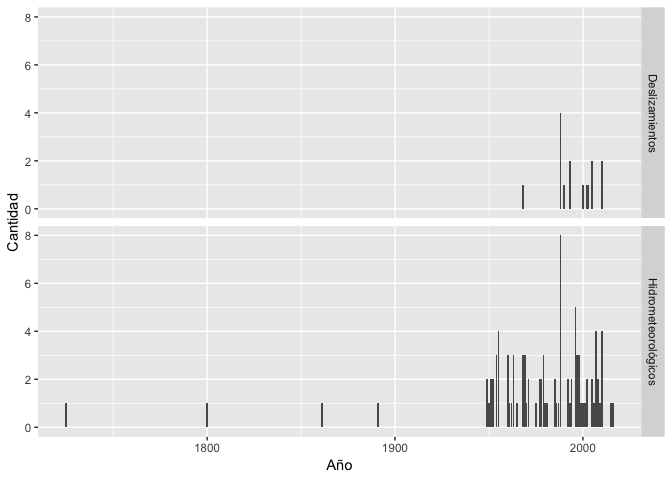

Visualización de la base de datos de desastres en Costa Rica
================
Guillermo Durán Sanabria
11/16/2018

Los datos se extrayeron del pdf de la 2nda edición del documento
*Histórico de desastres en Costa Rica. Febrero 1723 - Abril 2017*
elaborado por la **Comisión nacional de prevención de riesgos y atención
de emergencias (CNE) de Costa Rica** utilizando la herramienta gratuita
Tabula <https://tabula.technology>.

El documento pdf puede ser descargado en el siguiente enlace:
<https://www.cne.go.cr/index.php/documentacienuprincipal-96/historico-de-desastres-en-costa-rica>

Para el análisis se extrayeron las tablas sobre los eventos
hidrometeorológicos y deslizamientos del documento. Se seleccionaron
únicamente estas dos tipos de desastres por ser los que guardan una
relación directa a variabilidad y cambio climático.

Este tutorial se llevará a cabo utilizando R junto con los paquetes del
**Tidyverse** para la manipulación de los datos y análisis de texto,
**lubridate** para las series de tiempo, y los paquetes **sf** y
**tmap** para el análisis espacial y generación de
    mapas.

``` r
library(tidyverse)
```

    ## ── Attaching packages ─────────────────────────────────────────────────────────────────────── tidyverse 1.2.1 ──

    ## ✔ ggplot2 3.1.0     ✔ purrr   0.2.5
    ## ✔ tibble  1.4.2     ✔ dplyr   0.7.8
    ## ✔ tidyr   0.8.2     ✔ stringr 1.3.1
    ## ✔ readr   1.1.1     ✔ forcats 0.3.0

    ## ── Conflicts ────────────────────────────────────────────────────────────────────────── tidyverse_conflicts() ──
    ## ✖ dplyr::filter() masks stats::filter()
    ## ✖ dplyr::lag()    masks stats::lag()

``` r
library(lubridate)
```

    ## 
    ## Attaching package: 'lubridate'

    ## The following object is masked from 'package:base':
    ## 
    ##     date

``` r
library(sf)
```

    ## Linking to GEOS 3.6.1, GDAL 2.1.3, PROJ 4.9.3

``` r
library(tmap)
```

1.  Preparación de la tabla general, utilizando las tablas generadas en
    Tabula (notese que la columna de FECHA se está importando como tipo
    *date* y se están eliminando los encabezados de cada tabla
    individual)

<!-- end list -->

``` r
tablahidro <- read_csv("datos/tabula-historico_desastres_hidrometeo.csv", 
    col_types = cols(FECHA = col_date(format = "%Y/%m/%d"))) %>% 
  na.omit() %>% 
  mutate(TIPO = "Hidrometeorológicos")

tablades <- read_csv("datos/tabula-historico_desastres_deslizamientos.csv", 
    col_types = cols(FECHA = col_date(format = "%Y/%m/%d"))) %>% 
  na.omit() %>% 
  mutate(TIPO = "Deslizamientos")

names(tablahidro) <- names(tablades) #hacemos que los encabezados de ambas tablas sean iguales 
tablaGeneral <- rbind(tablades, tablahidro) #juntamos ambas tablas en una tabla general
```

Cronología con el número de eventos por cada tipo (Hidrometeorológicos y
Deslizamientos) por año.

``` r
ggplot(tablaGeneral %>% 
         mutate(aNo = year(FECHA)) %>% 
         group_by(aNo, TIPO) %>% 
         summarise(Cantidad = n()), 
       aes(x = aNo, y = Cantidad)) +
  geom_col() +
  facet_grid(rows = vars(TIPO)) +
  labs(x = "Año")
```

<!-- -->
