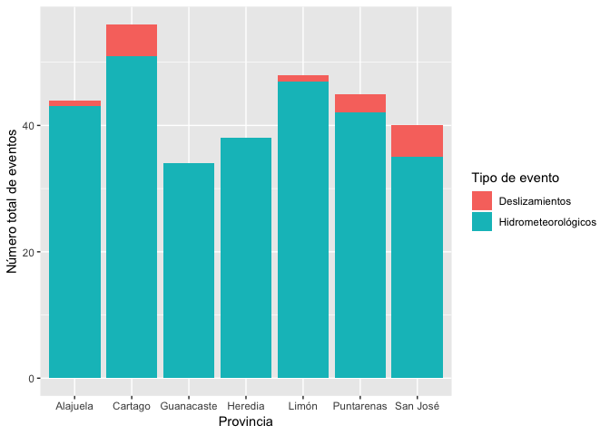
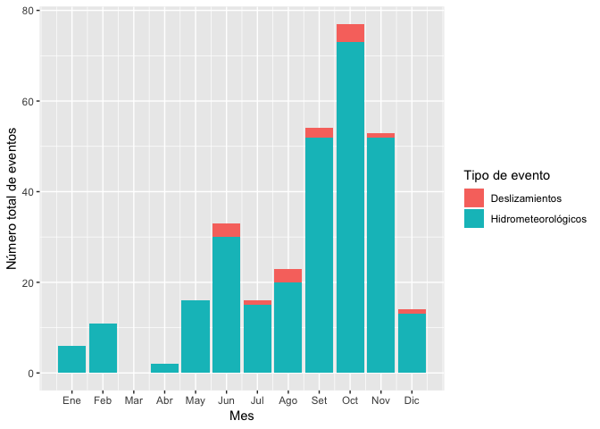
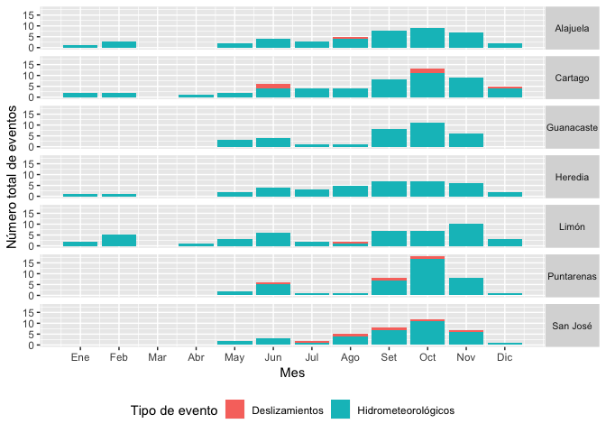
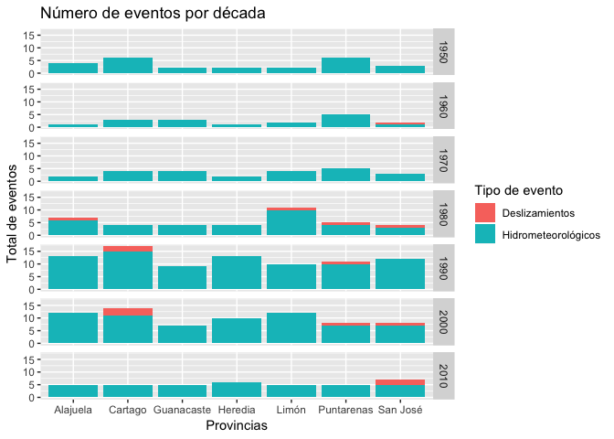
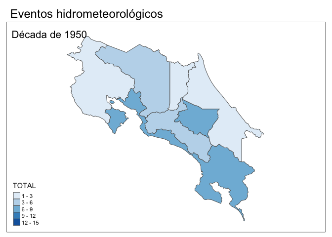
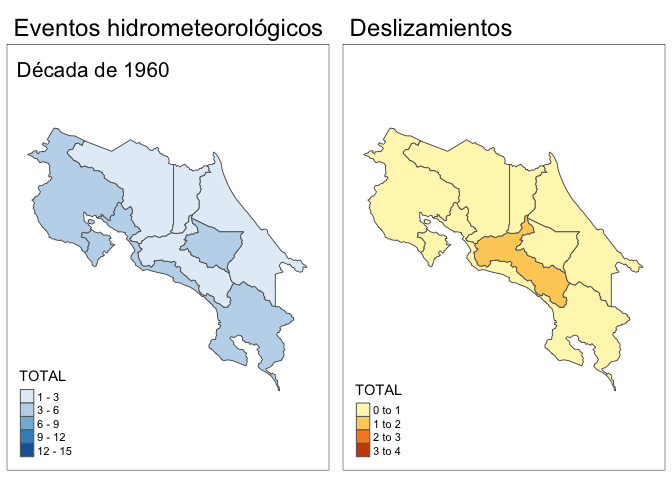
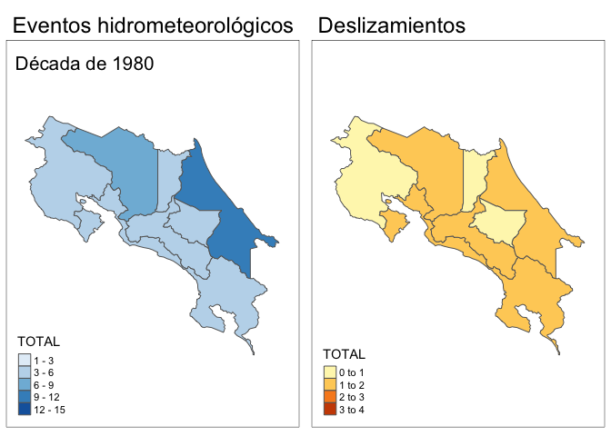
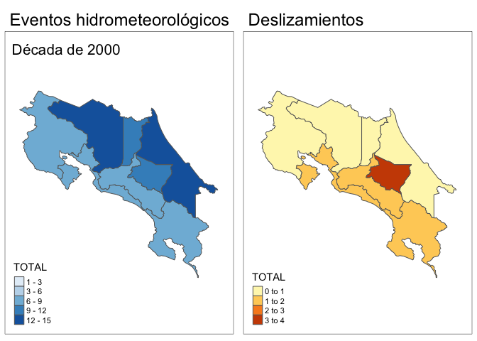
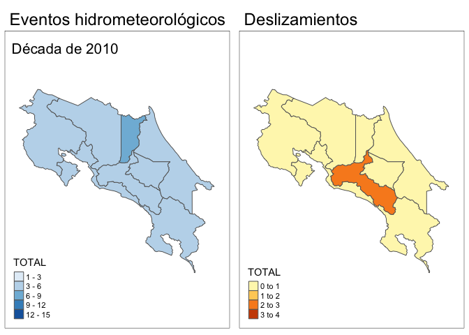

Visualización de la base de datos de desastres en Costa Rica
================
Guillermo Durán Sanabria
11/29/2018

El objetivo de este tutorial es hacer un análisis temporal y geográfico
de los desastres relacionados a eventos hidrometeorológicos y
deslizamientos en Costa Rica. El análisis se llevará a cabo utilizando
datos públicos generados por distintas instituciones gubernamentales de
Costa Rica.

-----

### Procedencia de los datos

  - Los datos se extrajeron del pdf de la 2nda edición del documento
    *Histórico de desastres en Costa Rica. Febrero 1723 - Abril 2017*
    \[1\] elaborado por la [**Comisión Nacional de Prevención de Riesgos
    y Atención de Emergencias (CNE) de Costa
    Rica**](https://www.cne.go.cr) utilizando la herramienta gratuita
    [Tabula](https://tabula.technology).

<!-- end list -->

  - Para el análisis se extrajeron del documento las tablas sobre los
    eventos hidrometeorológicos y deslizamientos. Se seleccionaron
    únicamente estos dos tipos de desastres por ser los que guardan una
    relación directa con el clima.

  - Este tutorial se llevará a cabo utilizando R junto con los paquetes
    del **tidyverse** para la manipulación de los datos, **lubridate**
    para las series de tiempo, y los paquetes **sf** y **tmap** para el
    análisis espacial y generación de mapas.

Cargar los paquetes requeridos:

``` r
library(tidyverse)
library(lubridate)
library(sf)
library(tmap)
```

-----

### Intrucciones para realizar el análisis

1.  Preparación de la tabla general utilizando las tablas generadas en
    Tabula.

Notese que la columna de FECHA se está importando como tipo *date* y se
están eliminando los encabezados de cada tabla
individual.

``` r
tablahidro <- read_csv("datos/tabula-historico_desastres_hidrometeo.csv", 
    col_types = cols(FECHA = col_date(format = "%Y/%m/%d"))) %>% 
  na.omit() %>% 
  mutate(TIPO = "Hidrometeorológicos")

tablades <- read_csv("datos/tabula-historico_desastres_deslizamientos.csv", 
    col_types = cols(FECHA = col_date(format = "%Y/%m/%d"))) %>% 
  na.omit() %>% 
  mutate(TIPO = "Deslizamientos")

names(tablahidro) <- names(tablades) #hacemos que los encabezados de ambas tablas sean iguales 
tablaGeneral <- rbind(tablades, tablahidro) %>%  #juntamos ambas tablas en una tabla general
  mutate(ID = row_number())
```

Gráfico cronológico con el número de eventos por cada tipo de desastre.

``` r
ggplot(tablaGeneral %>% 
         mutate(aNo = year(FECHA)) %>% 
         group_by(aNo, TIPO) %>% 
         summarise(Cantidad = n()), 
       aes(x = aNo, y = Cantidad)) +
  geom_col() +
  facet_grid(rows = vars(TIPO)) +
  labs(x = "Año")
```

<!-- -->
\*\*\* 2. Utilizando las descripciones de cada evento, trataremos de
asignar automáticamente las provincias que impactaron.

Dado que la tabla no tiene un componente geográfico en su estructura,
vamos a asignarle uno. El código crea una columna lógica por provincia y
le asigna un **TRUE** o **FALSE** si el nombre de la provincia aparece
en la columna *`TÍTULO DEL EVENTO`*. Se hizo de esta manera ya que hay
varios eventos que reportaron daños en varias provincias.

``` r
tablaGeneral_mod <- tablaGeneral %>% 
  mutate(
    `TÍTULO DEL EVENTO` = str_replace_all(`TÍTULO DEL EVENTO`, "\\r", " "),
    OBSERVACIONES  = str_replace_all(`TÍTULO DEL EVENTO`, "\\r", " "),
    Desc = paste(`TÍTULO DEL EVENTO`, OBSERVACIONES, sep = " "),
    GUANACASTE = if_else(str_detect(Desc, "Guanacaste"), TRUE, FALSE),
    SANJOSE = if_else(str_detect(Desc, "San José"), TRUE, FALSE),
    HEREDIA = if_else(str_detect(Desc, "Heredia"), TRUE, FALSE),
    ALAJUELA = if_else(str_detect(Desc, "Alajuela"), TRUE, FALSE),
    PUNTARENAS = if_else(str_detect(Desc, "Puntarenas"), TRUE, FALSE),
    CARTAGO = if_else(str_detect(Desc, "Cartago"), TRUE, FALSE),
    LIMON = if_else(str_detect(Desc, "Limón"), TRUE, FALSE))
```

El conteo de eventos por provincia es:

``` r
tablaGeneral_mod %>% select(8:14) %>% summarise_all(funs(sum(.)))
```

    ## # A tibble: 1 x 7
    ##   GUANACASTE SANJOSE HEREDIA ALAJUELA PUNTARENAS CARTAGO LIMON
    ##        <int>   <int>   <int>    <int>      <int>   <int> <int>
    ## 1          6      10       3        8         12      18    10

Revisión de elementos sin provincia asignada:

``` r
faltantes <- tablaGeneral_mod %>% 
  mutate(total = GUANACASTE + SANJOSE + HEREDIA + ALAJUELA + PUNTARENAS + CARTAGO + LIMON) %>% 
  filter(total == 0)

faltantes %>% summarise(n())
```

    ## # A tibble: 1 x 1
    ##   `n()`
    ##   <int>
    ## 1    49

Deberemos asignar provincia a los 49 eventos que quedaron vacíos.

Como el número de entradas que quedaron sin asignar no es tan grande, la
asignación de las provincias podría hacerse manualmente en un programa
de hoja de cálculo (Excel, por ejemplo), pero también lo podemos hacer
automáticamente desde R.

Para esto último debemos primero hacer un conteo de las palabras más
comunes en los títulos de esos 49 eventos utilizando los paquetes
**tidytext** y un vector de *stop\_words* en Castellano del paquete
**tm**.

``` r
library(tm)
```

    ## Loading required package: NLP

    ## 
    ## Attaching package: 'NLP'

    ## The following object is masked from 'package:ggplot2':
    ## 
    ##     annotate

``` r
library(tidytext)

custom_stop_words <- bind_rows(
  stop_words,
  data_frame(Palabras = tm::stopwords(kind = "sp"),
             lexicon = "custom")) %>% 
  filter(lexicon == "custom")
```

Conteo de palabras en las descripciones de los eventos:

``` r
faltantes %>% select(ID, Desc) %>%
  unnest_tokens(Palabras, Desc) %>% 
  anti_join(custom_stop_words) %>%
  count(Palabras, sort = TRUE)
```

    ## Joining, by = "Palabras"

    ## # A tibble: 132 x 2
    ##    Palabras         n
    ##    <chr>        <int>
    ##  1 inundaciones    40
    ##  2 río             34
    ##  3 huracán         26
    ##  4 caribe          22
    ##  5 tropical        22
    ##  6 vertiente       14
    ##  7 zona            14
    ##  8 tormenta        12
    ##  9 baja            10
    ## 10 presión         10
    ## # ... with 122 more rows

Viendo las palabras más comunes nos damos cuenta que hay frases que
podemos asignar a las provincias. Estas son:

  - Vertiente Caribe: Limón, Alajuela, Heredia, Cartago
  - Vertiente Caribe = Zona Atlántica
  - Zona Norte: Alajuela y Heredia
  - Valle Central: Heredia, San José, Alajuela y Cartago
  - Zona Sur: Puntarenas

Escribimos un script que asocie esas palabras con las provincias
respectivas:

``` r
faltantes_mod <- faltantes %>% 
  mutate_at(.vars = c("LIMON", "ALAJUELA", "HEREDIA", "CARTAGO"), 
            funs(if_else(str_detect(Desc, regex("Vertiente Caribe", ignore_case = TRUE)), 
                         TRUE, .))) %>% 
  mutate_at(.vars = c("LIMON", "ALAJUELA", "HEREDIA", "CARTAGO"), 
            funs(if_else(str_detect(Desc, regex("Vertiente\\s*\\w*\\sCaribe", ignore_case = TRUE)), 
                         TRUE, .))) %>% 
  mutate_at(.vars = c("LIMON", "ALAJUELA", "HEREDIA", "CARTAGO"), 
            funs(if_else(str_detect(Desc, regex("Zona Caribe", ignore_case = TRUE)), 
                         TRUE, .))) %>% 
  mutate_at(.vars = c("LIMON", "ALAJUELA", "HEREDIA", "CARTAGO"), 
            funs(if_else(str_detect(Desc, regex("Zona Atlántica", ignore_case = TRUE)), 
                         TRUE, .))) %>% 
  mutate_at(.vars = c("ALAJUELA", "HEREDIA", "CARTAGO"), 
            funs(if_else(str_detect(Desc, regex("Zona Norte", ignore_case = TRUE)), 
                         TRUE, .))) %>% 
  mutate_at(.vars = c("PUNTARENAS"), 
            funs(if_else(str_detect(Desc, regex("Zona Sur", ignore_case = TRUE)), 
                         TRUE, .))) %>% 
  mutate_at(.vars = c("SANJOSE", "ALAJUELA", "HEREDIA", "CARTAGO"), 
            funs(if_else(str_detect(Desc, regex("Valle Central", ignore_case = TRUE)), 
                         TRUE, .)))
```

Aun luego del paso anterior nos quedan varios eventos sin provincia
asignada:

``` r
faltantes2 <- faltantes_mod %>% 
  mutate(total = GUANACASTE + SANJOSE + HEREDIA + ALAJUELA + PUNTARENAS + CARTAGO + LIMON) %>% 
  filter(total == 0)

faltantes2 %>% summarise(n())
```

    ## # A tibble: 1 x 1
    ##   `n()`
    ##   <int>
    ## 1    39

Revisando las descripciones de los que quedan por asignar vemos que
muchos son huracanes, tormentas (tropicales) y sistemas de baja
(presión):

``` r
faltantes2 %>% select(ID, Desc) %>%
  unnest_tokens(Palabras, Desc) %>% 
  anti_join(custom_stop_words) %>%
  count(Palabras, sort = TRUE)
```

    ## Joining, by = "Palabras"

    ## # A tibble: 112 x 2
    ##    Palabras         n
    ##    <chr>        <int>
    ##  1 inundaciones    28
    ##  2 río             28
    ##  3 huracán         24
    ##  4 tropical        20
    ##  5 caribe          10
    ##  6 tormenta        10
    ##  7 baja             8
    ##  8 presión          8
    ##  9 sistema          8
    ## 10 grande           6
    ## # ... with 102 more rows

Ya que estos no tienen una ubicación asignada, asumimos que afectaron a
todo el país:

``` r
faltantes2_mod <- faltantes2 %>% 
  mutate(PUNTARENAS = ifelse(str_detect(Desc, regex("río Grande de Térraba", ignore_case = TRUE)), 
                             TRUE, FALSE)) %>% 
  mutate_at(.vars = c("LIMON", "ALAJUELA", "HEREDIA", "CARTAGO", "SANJOSE", "PUNTARENAS", "GUANACASTE"), 
            funs(if_else(str_detect(Desc, 
                                    regex("huracán", ignore_case = TRUE)), TRUE, .))) %>% 
  mutate_at(.vars = c("LIMON", "ALAJUELA", "HEREDIA", "CARTAGO", "SANJOSE", "PUNTARENAS", "GUANACASTE"), 
            funs(if_else(str_detect(Desc, 
                                    regex("ciclón tropical", ignore_case = TRUE)), TRUE, .))) %>% 
  mutate_at(.vars = c("LIMON", "ALAJUELA", "HEREDIA", "CARTAGO", "SANJOSE", "PUNTARENAS", "GUANACASTE"), 
            funs(if_else(str_detect(Desc, 
                                    regex("huracanes", ignore_case = TRUE)), TRUE, .))) %>% 
  mutate_at(.vars = c("LIMON", "ALAJUELA", "HEREDIA", "CARTAGO", "SANJOSE", "PUNTARENAS", "GUANACASTE"), 
            funs(if_else(str_detect(Desc, 
                                    regex("tormenta tropical", ignore_case = TRUE)), TRUE, .))) %>% 
  mutate_at(.vars = c("LIMON", "ALAJUELA", "HEREDIA", "CARTAGO", "SANJOSE", "PUNTARENAS", "GUANACASTE"), 
            funs(if_else(str_detect(Desc, 
                                    regex("sistema\\s*\\w*\\sbaja presión", ignore_case = TRUE)), TRUE, .)))
```

Las faltantes luego del paso anterior:

``` r
faltantes3 <- faltantes2_mod %>% 
  mutate(total = GUANACASTE + SANJOSE + HEREDIA + ALAJUELA + PUNTARENAS + CARTAGO + LIMON) %>% 
  filter(total == 0)

faltantes3 %>% summarise(n())
```

    ## # A tibble: 1 x 1
    ##   `n()`
    ##   <int>
    ## 1    15

Después del proceso de tratar de asignar automáticamente una provincia a
cada evento a través de un análisis de las descripciones, quedamos con
15 eventos que debemos revisar manualmente y asignarle una provincia.
Tomando como base la tabla *faltantes3* asignamos provincias de acuerdo
a la columna *ID*.

``` r
#ID asignado a cada provincia
CARTAGOm <- c(8, 49, 62, 98, 101, 103, 104, 105)
SANJOSEm <- c(50, 62, 98, 101, 103, 105)
HEREDIAm <- c(62, 98, 101, 103, 105)
GUANACASTEm <- c(62, 80, 98, 101, 103, 105)
PUNTARENASm <- c(56, 62, 80, 98, 101, 103, 105)
ALAJUELAm <- c(62, 98, 101, 103, 104, 105)
LIMONm <- c(21, 49, 62, 63, 67, 94, 98, 101, 103, 104, 105) 
```

Asignamos valores **TRUE** a las filas correspondientes (número en cada
vector) de las columnas de cada provincia.

``` r
faltantes3_mod <- faltantes3 %>% 
  mutate(CARTAGO = if_else(ID %in% CARTAGOm, TRUE, FALSE),
         SANJOSE = if_else(ID %in% SANJOSEm, TRUE, FALSE),
         HEREDIA = if_else(ID %in% HEREDIAm, TRUE, FALSE),
         GUANACASTE = if_else(ID %in% GUANACASTEm, TRUE, FALSE),
         PUNTARENAS = if_else(ID %in% PUNTARENASm, TRUE, FALSE),
         ALAJUELA = if_else(ID %in% ALAJUELAm, TRUE, FALSE),
         LIMON = if_else(ID %in% LIMONm, TRUE, FALSE))
```

Juntamos todas las tablas:

``` r
tablaGLimpia <- rbind(faltantes3_mod, 
      faltantes2_mod %>% 
        mutate(total = GUANACASTE + SANJOSE + HEREDIA + ALAJUELA + PUNTARENAS + CARTAGO + LIMON) %>% 
        filter(total != 0), 
      faltantes_mod %>% 
        mutate(total = GUANACASTE + SANJOSE + HEREDIA + ALAJUELA + PUNTARENAS + CARTAGO + LIMON) %>% 
        filter(total != 0),
      tablaGeneral_mod %>% 
        mutate(total = GUANACASTE + SANJOSE + HEREDIA + ALAJUELA + PUNTARENAS + CARTAGO + LIMON) %>% 
        filter(total != 0)) %>% 
  select(-Desc, -total)
```

Finalmente podemos graficar el número de desastres totales por
provincia:

``` r
ggplot(tablaGLimpia %>% 
         select(5, 7:13) %>% 
         group_by(TIPO) %>% 
         summarise_all(funs(sum(.))) %>% 
         gather(key = PROVINCIA, value = TOTAL, -TIPO) %>% 
         mutate(PROVINCIA = replace(PROVINCIA, PROVINCIA == "SANJOSE", "San José"), 
                PROVINCIA = replace(PROVINCIA, PROVINCIA == "GUANACASTE", "Guanacaste"),
                PROVINCIA = replace(PROVINCIA, PROVINCIA == "LIMON", "Limón"),
                PROVINCIA = replace(PROVINCIA, PROVINCIA == "HEREDIA", "Heredia"),
                PROVINCIA = replace(PROVINCIA, PROVINCIA == "PUNTARENAS", "Puntarenas"),
                PROVINCIA = replace(PROVINCIA, PROVINCIA == "CARTAGO", "Cartago"),
                PROVINCIA = replace(PROVINCIA, PROVINCIA == "ALAJUELA", "Alajuela")), 
       aes(x = PROVINCIA, y = TOTAL, fill = TIPO)) +
  geom_col() +
  labs(x = "Provincia", y = "Número total de eventos", fill = "Tipo de evento")
```

<!-- -->

Podemos también hacer un análisis del número de eventos por mes:

``` r
tablaPorMes <- tablaGLimpia %>% 
  mutate(MES = month(FECHA)) %>% 
  select(5, 7:14) %>% 
  group_by(MES, TIPO) %>% 
  summarise_all(funs(sum(.))) %>% 
  gather(key = PROVINCIA, value = TOTAL, -TIPO, -MES) %>% 
  mutate(PROVINCIA = replace(PROVINCIA, PROVINCIA == "SANJOSE", "San José"), 
         PROVINCIA = replace(PROVINCIA, PROVINCIA == "GUANACASTE", "Guanacaste"),
         PROVINCIA = replace(PROVINCIA, PROVINCIA == "LIMON", "Limón"),
         PROVINCIA = replace(PROVINCIA, PROVINCIA == "HEREDIA", "Heredia"),
         PROVINCIA = replace(PROVINCIA, PROVINCIA == "PUNTARENAS", "Puntarenas"),
         PROVINCIA = replace(PROVINCIA, PROVINCIA == "CARTAGO", "Cartago"),
         PROVINCIA = replace(PROVINCIA, PROVINCIA == "ALAJUELA", "Alajuela"))

ggplot(tablaPorMes %>% 
         group_by(MES, TIPO) %>% 
         summarise(TOTAL = sum(TOTAL)), aes(x = MES, y = TOTAL, fill = TIPO)) +
  geom_col() +
  labs(x = "Mes", y = "Número total de eventos", fill = "Tipo de evento") +
  scale_x_continuous(breaks=c(1:12),
                     labels=c("Ene", "Feb", "Mar", "Abr", "May", "Jun", "Jul", "Ago", "Set", "Oct", "Nov", "Dic"))
```

<!-- -->

Y por provincia:

``` r
ggplot(tablaPorMes %>% 
         group_by(MES, TIPO, PROVINCIA) %>% 
         summarise(TOTAL = sum(TOTAL)), aes(x = MES, y = TOTAL, fill = TIPO)) +
  geom_col() +
  facet_grid(rows = vars(PROVINCIA)) +
  labs(x = "Mes", y = "Número total de eventos", fill = "Tipo de evento") +
  scale_x_continuous(breaks=c(1:12),
                     labels=c("Ene", "Feb", "Mar", "Abr", "May", "Jun", "Jul", "Ago", "Set", "Oct", "Nov", "Dic")) +
  theme(legend.position="bottom", 
        strip.text.y = element_text(size = 8, margin = margin(1, 1, 1, 1), angle = 0))
```

<!-- -->
\*\*\* 3. Creación de mapas

Descargamos los datos geográficos de límites provinciales y toponimia
del **Sistema Nacional de Información Territorial** (SNIT).

``` r
library(gdalUtils)
library(rgdal)
library(rmapshaper)

dsn_prov <- "WFS:http://geos.snitcr.go.cr/be/IGN_5/wfs?"
ogrListLayers(dsn_prov) #lista de capas en ese WFS
```

    ## [1] "IGN_5:indice_5000"         "IGN_5:curvas_5000"        
    ## [3] "IGN_5:hidrografia_5000"    "IGN_5:limitecantonal_5k"  
    ## [5] "IGN_5:limitedistrital_5k"  "IGN_5:limiteprovincial_5k"
    ## [7] "IGN_5:linea_costa_5000"    "IGN_5:urbano_5000"        
    ## [9] "IGN_5:vias_5000"          
    ## attr(,"driver")
    ## [1] "WFS"
    ## attr(,"nlayers")
    ## [1] 9

``` r
provincias_geo <- st_read(dsn_prov, "IGN_5:limiteprovincial_5k")
```

    ## Reading layer `IGN_5:limiteprovincial_5k' from data source `WFS:http://geos.snitcr.go.cr/be/IGN_5/wfs?' using driver `WFS'
    ## Simple feature collection with 7 features and 25 fields
    ## geometry type:  MULTIPOLYGON
    ## dimension:      XY
    ## bbox:           xmin: 156152 ymin: 608833.8 xmax: 658879.5 ymax: 1241118
    ## epsg (SRID):    5367
    ## proj4string:    +proj=tmerc +lat_0=0 +lon_0=-84 +k=0.9999 +x_0=500000 +y_0=0 +ellps=WGS84 +towgs84=0,0,0,0,0,0,0 +units=m +no_defs

``` r
provincias_geo <- ms_simplify(ms_simplify(provincias_geo)) #simplificación de borde de los polígonos
  
dsn_pob <- "WFS:http://geos.snitcr.go.cr/be/IGN_NG/wms?"
ogrListLayers(dsn_pob) #lista de capas en ese WFS
```

    ## [1] "IGN_NG:accidentescosteros_25k"        
    ## [2] "IGN_NG:ng_190508_25k"                 
    ## [3] "IGN_NG:ng_190505_25k"                 
    ## [4] "IGN_NG:ng_190211_25k"                 
    ## [5] "IGN_NG:edificacionesobraspublicas_25k"
    ## [6] "IGN_NG:hidronimos_25k"                
    ## [7] "IGN_NG:nombresgeograficos_25k"        
    ## [8] "IGN_NG:oronimos_25k"                  
    ## [9] "IGN_NG:toponimos_25k"                 
    ## attr(,"driver")
    ## [1] "WFS"
    ## attr(,"nlayers")
    ## [1] 9

``` r
poblados_geo <- st_read(dsn_pob, "IGN_NG:toponimos_25k")
```

    ## Reading layer `IGN_NG:toponimos_25k' from data source `WFS:http://geos.snitcr.go.cr/be/IGN_NG/wms?' using driver `WFS'
    ## Simple feature collection with 9785 features and 5 fields
    ## geometry type:  POINT
    ## dimension:      XY
    ## bbox:           xmin: 161715.1 ymin: 612663.7 xmax: 657704 ymax: 1240833
    ## epsg (SRID):    5367
    ## proj4string:    +proj=tmerc +lat_0=0 +lon_0=-84 +k=0.9999 +x_0=500000 +y_0=0 +ellps=WGS84 +towgs84=0,0,0,0,0,0,0 +units=m +no_defs

-----

Mapas con número de eventos por provincias:

Primero realizamos un conteo de eventos por provincia y una unión de
tablas utilizando el límite provincial descargado en el paso anterior
(nótese que este último es un objeto **sf**)

``` r
numProvin <- provincias_geo %>% 
  select(nom_prov) %>% 
  left_join(tablaGLimpia %>% 
              select(5, 7:13) %>% 
              group_by(TIPO) %>% 
              summarise_all(funs(sum(.))) %>% 
              gather(key = PROVINCIA, value = TOTAL, -TIPO) %>% 
              mutate(PROVINCIA = replace(PROVINCIA, PROVINCIA == "SANJOSE", "San José"), 
                     PROVINCIA = replace(PROVINCIA, PROVINCIA == "GUANACASTE", "Guanacaste"),
                     PROVINCIA = replace(PROVINCIA, PROVINCIA == "LIMON", "Limón"),
                     PROVINCIA = replace(PROVINCIA, PROVINCIA == "HEREDIA", "Heredia"),
                     PROVINCIA = replace(PROVINCIA, PROVINCIA == "PUNTARENAS", "Puntarenas"),
                     PROVINCIA = replace(PROVINCIA, PROVINCIA == "CARTAGO", "Cartago"),
                     PROVINCIA = replace(PROVINCIA, PROVINCIA == "ALAJUELA", "Alajuela")),
            by = c("nom_prov" = "PROVINCIA"))
```

    ## Warning: Column `nom_prov`/`PROVINCIA` joining factor and character vector,
    ## coercing into character vector

Generación de los mapas:

``` r
library(tmap)

bbox <- st_bbox(c(xmin = 270000, xmax = 680000, ymax = 1260000, ymin = 880000))

tm_hidro <- tm_shape(numProvin %>% filter(TIPO == "Hidrometeorológicos"),
                     bbox = bbox) +
  tm_polygons(col = "TOTAL", palette = "Blues") +
  tm_layout(title = "Eventos hidrometeorológicos",
            legend.format = list(text.separator = "-"))

tm_deliz <- tm_shape(numProvin %>% filter(TIPO == "Deslizamientos"),
                     bbox = bbox) +
  tm_polygons(col = "TOTAL") +
  tm_layout(title = "Deslizamientos",
            legend.format = list(text.separator = "-"))

tmap_arrange(tm_hidro, tm_deliz)
```

<!-- -->

Cálculo de cantidad de eventos por década a partir de 1950:

``` r
numProvinDecada <- provincias_geo %>% 
  select(nom_prov) %>% 
  left_join(tablaGLimpia %>% 
              filter(FECHA >= ymd("1950-01-01")) %>% 
              mutate(DECADA = format(floor_date(FECHA, years(10)), '%Y')) %>% 
              select(5, 7:14) %>% 
              group_by(TIPO, DECADA) %>% 
              summarise_all(funs(sum(.))) %>% 
              gather(key = PROVINCIA, value = TOTAL, -TIPO, -DECADA) %>% 
              mutate(PROVINCIA = replace(PROVINCIA, PROVINCIA == "SANJOSE", "San José"), 
                     PROVINCIA = replace(PROVINCIA, PROVINCIA == "GUANACASTE", "Guanacaste"),
                     PROVINCIA = replace(PROVINCIA, PROVINCIA == "LIMON", "Limón"),
                     PROVINCIA = replace(PROVINCIA, PROVINCIA == "HEREDIA", "Heredia"),
                     PROVINCIA = replace(PROVINCIA, PROVINCIA == "PUNTARENAS", "Puntarenas"),
                     PROVINCIA = replace(PROVINCIA, PROVINCIA == "CARTAGO", "Cartago"),
                     PROVINCIA = replace(PROVINCIA, PROVINCIA == "ALAJUELA", "Alajuela")),
            by = c("nom_prov" = "PROVINCIA"))
```

    ## Warning: Column `nom_prov`/`PROVINCIA` joining factor and character vector,
    ## coercing into character vector

Gráficos por décadas:

``` r
ggplot(numProvinDecada, aes(x = nom_prov, y = TOTAL, fill = TIPO)) +
  geom_col() +
  facet_grid(rows = vars(DECADA)) +
  labs(x = "Provincias", 
       y = "Total de eventos", 
       title = "Número de eventos por década",
       fill = "Tipo de evento")
```

<!-- -->
\*\*\* Mapas por década: Preparación de los datos

Para tener una escala estándar de colores para cada década calculamos
los máximos y mínimos acumulados:

``` r
summary(numProvinDecada %>% as.data.frame() %>% 
  group_by(DECADA, TIPO, nom_prov) %>% 
  summarise(TOTAL = sum(TOTAL)) %>% 
  spread(key = TIPO, value = TOTAL))
```

    ##     DECADA            nom_prov         Deslizamientos  
    ##  Length:49          Length:49          Min.   :0.0000  
    ##  Class :character   Class :character   1st Qu.:0.0000  
    ##  Mode  :character   Mode  :character   Median :0.0000  
    ##                                        Mean   :0.4286  
    ##                                        3rd Qu.:1.0000  
    ##                                        Max.   :3.0000  
    ##                                        NA's   :14      
    ##  Hidrometeorológicos
    ##  Min.   : 1.000     
    ##  1st Qu.: 3.000     
    ##  Median : 5.000     
    ##  Mean   : 5.796     
    ##  3rd Qu.: 7.000     
    ##  Max.   :15.000     
    ## 

Función de mapeo

``` r
decadas <- numProvinDecada %>% 
  as.data.frame() %>% 
  select(DECADA) %>% 
  arrange(DECADA) %>% 
  group_by(DECADA) %>% 
  summarise() %>% 
  pull(DECADA)


funMapasDec <- function(dec) {
  tm_hidro <- tm_shape(numProvinDecada %>% 
                         filter(TIPO == "Hidrometeorológicos" &
                                  DECADA == dec),
                       bbox = bbox) +
    tm_polygons(col = "TOTAL", 
                palette = "Blues",
                style = "fixed",
                breaks = c(1, 3, 6, 9, 12, 15),
                colorNA = "white") +
    tm_layout(main.title = "Eventos hidrometeorológicos",
              title = paste0("Década de ", dec),
              legend.format=list(fun=function(x) formatC(x, digits=0, format="d"), text.separator = "-"))
  
  if (is.element("Deslizamientos", numProvinDecada %>% 
                 filter(DECADA == dec) %>% 
                 pull(TIPO))) {
    tm_deliz <- tm_shape(numProvinDecada %>% 
                           filter(TIPO == "Deslizamientos" &
                                    DECADA == dec),
                         bbox = bbox) +
      tm_polygons(col = "TOTAL",
                  palette = "YlOrBr",
                  style = "fixed",
                  breaks = c(0, 1, 2, 3, 4)) +
      tm_layout(main.title = "Deslizamientos")
    
    tmap_arrange(tm_hidro, tm_deliz)
  } else {
    tmap_arrange(tm_hidro)
  }
} 
```

Creación de los mapas:

``` r
map(decadas, funMapasDec)
```

    ## [[1]]

    ## 
    ## [[2]]

<!-- -->

    ## 
    ## [[3]]

<!-- -->

    ## 
    ## [[4]]

<!-- -->

    ## 
    ## [[5]]

<!-- -->

    ## 
    ## [[6]]

<!-- -->

    ## 
    ## [[7]]

<!-- --><!-- -->

Y finalmente, un app en *Shiny* que permita seleccionar el periodo,
mostrando un mapa de los eventos y la tabla con sus descripciones.

-----


1.  El documento pdf puede descargarse del siguiente enlace:
    <https://www.cne.go.cr/index.php/documentacienuprincipal-96/historico-de-desastres-en-costa-rica>
